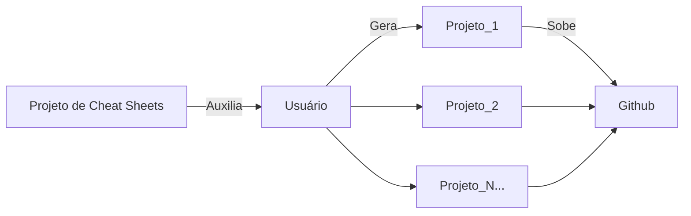

# Cheat-Sheets

Esse repositório é mais para uma referência de cheat sheets que encontramos por aí e não sabemos onde guardar. Estava passeando pelo github ultimamente e encontrei um engenheiro de dados que faz isso e achei bem interessante e prático. Por mais que seja algo para facilitar a minha vida, pode facilitar a sua também e caso queira adicionar, seja fazendo um fork ou querendo colocar aqui também é bem vindo!

Minha ideia seria mais separar por temas, então podemos pensar em Data Science, Data Engineering, e por aí vai e dentro delas podemos separar por linha de código ou por teoria 😉

Como por exemplo a ideia abaixo:

```
📂 CheatSheets-Repo
│── 📁 Data Science
│   ├── 📄 Python_Tips.pdf
│   ├── 📄 Pandas_Cheatsheet.pdf
│   ├── 📄 NumPy_Basics.pdf
│   ├── 📄 Machine_Learning_Concepts.pdf
│── 📁 Data Engineering
│   ├── 📄 SQL_Queries.pdf
│   ├── 📄 ETL_Pipelines.pdf
│── 📁 DevOps
│   ├── 📄 Docker_Commands.pdf
│   ├── 📄 CI_CD_Pipelines.pdf
│── 📁 General
│   ├── 📄 Git_Commands.pdf
│   ├── 📄 Regex_Tips.pdf
│   ├── 📄 Bash_Scripting.pdf
│── 📄 README.md
```

Não é só para código, porém também serve para shortcuts também!

Se tiverem mais ideias, fiquem à vontade para compartilhar. Por enquanto estou pegando de lugares que disponibilizaram online, porém depois posso ir adicionando meus resumos e Cheat Sheets próprios. 

Enquanto projetos A e B são utilizados para mostrar minhas habilidades, esse repositório é mais para me ajudar a ter mais algumas referências! Então seu propósito é diferente.



